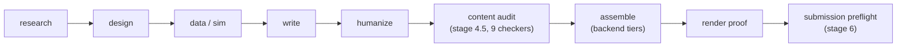

# Rigorloom

**A general HWP/HWPX document engine with deterministic gates, graded
render proof, and installable capability modules — Hancom-free by
default.**

[](https://github.com/pantagram1031/rigorloom/actions/workflows/ci.yml)
[](LICENSE)
[](https://github.com/pantagram1031/rigorloom/tags)
[](pyproject.toml)
[](docs/golden-path.md)

Rigorloom is an agent-neutral document engine for Korean HWP/HWPX forms —
recognition, fill, assembly, verification, and delivery — with an optional,
resumable report pipeline on top. Current release: **v0.17.0** (pending
tag). See [CHANGELOG.md](CHANGELOG.md) for the version history and
[docs/golden-path.md](docs/golden-path.md) for an end-to-end, Hancom-free
walkthrough.

**One core, six modules, seven bundles.** Since v0.16 the repo is a monorepo
with a single general-purpose core (the `engine/` document backends, form
recognition, render proof ladder, privacy scan, module registry, base Studio)
and capability that ships as separately installable **distribution modules**
behind one contract (`modules/README.md`). Six modules ship today: `report`
(stage machine, report checkers, compose resolver, playbooks), `style`
(translationese removal and voice consistency — never AI-detection evasion),
and four **work-type** modules added in v0.17 — `gongmun` (공문/기안문),
`minwon` (민원·신고 서식), `hr` (계약·인사 서식), and `grant` (지원사업 신청
packets) — each a deterministic checker set plus a skill fragment for its task
flow. General personalization pack types live in core, with report-flavored
packs supplied by the report module. Core never imports a module; absence is
not failure (the suite is green with every module disabled); the seven bundles
(`rigorloom-core` plus one per module) are built by
`scripts/package_module.py` at the same version.

**Validated from outside the checkout.** A repo test suite proves the code is
correct; it cannot prove that the *thing we ship* is complete. The clean-room
harness at [`evals/`](evals/README.md) installs the product the way a buyer
would — dist zips only, into a fresh temp root, enabled and skill-installed
through the shipped CLIs — and asserts containment on five independent axes,
with no code path that falls back to the checkout. That harness is what found
the v0.16.0 core bundle shipping no skill surface at all. Measured tier
guidance ships *with the product* at
[skill/references/model-routing.md](skill/references/model-routing.md): which
model tier to run which task class on, what was measured, and what is
explicitly unmeasured. The end-to-end form-fill procedure is one document,
[skill/references/fill-recipe.md](skill/references/fill-recipe.md) — the
branch-per-cell decision rule, the four artifacts and the flag that eats each,
the literal command sequence, and what an accepted verdict looks like.

Since 2026-05-18, Korean government systems accept HWPX-only attachments
while published blanks are still mostly `.hwp` — rigorloom's hwp→hwpx
conversion path is verified 10/10 on the official blank-form corpus
(`docs/research/xc1-conversion-bench.md`), with per-family capability
boundaries stated honestly in
[skill/references/forms.md](skill/references/forms.md).

The state machine is deterministic and provider-independent. Claude, Codex,
Gemini, local models, human operators, or any other capable agent can act as
the orchestrator or worker. Model names in examples are optional adapters,
not requirements. For agent use, a router skill surface ships at
[skill/SKILL.md](skill/SKILL.md) — a compact task router with a dynamic
capability probe (`engine/scripts/probe.py`); enabled modules merge their
own skill fragments at install time via `scripts/sync_local.py`.

## Why rigorloom

- **Deterministic gates that can't be post-edited.** Script verdicts are
  computed by code and recorded as immutable inputs to state transitions —
  the old "caller-supplied-integer" bypass was retired in v0.7 (see
  [CHANGELOG.md](CHANGELOG.md)).
- **A graded render proof ladder, not a single pass/fail.** Delivery is
  ranked `none < experimental-rhwp < advisory < certified < hancom` — v0.15
  added `certified`, an opt-in, HMAC-signed operator render certificate that
  lets the `hwpx` backend clear submission grade on equation-bearing
  documents without Hancom — and the ladder is cross-checked against what
  this machine can actually render, not trusted blindly.
- **Hancom-free HWPX assembly.** The `hwpx` backend fills a form's HWPX/OWPML
  XML directly through the bundled engine (`engine/scripts`), without Hancom
  or COM, on any OS.
- **Agent-neutral.** The stage machine drives entirely through CLIs; any
  coding-capable agent can orchestrate it, and provider roles are assigned by
  capability, not by vendor name (see [AGENTS.md](AGENTS.md)).

## Architecture



Stage 4.5 `content_audit` (report module) runs nine deterministic
sub-checkers before assembly is allowed to start; any sub-checker's HARD
finding fails the whole gate. Stage 6 `submission_preflight` grades the
finished artifact and requires a render `proof_grade` of `hancom`,
`certified`, or `advisory`. See
[docs/pipeline-master-v0.6.md](docs/pipeline-master-v0.6.md)
for the full stage graph and gate contracts.

## Feature highlights

- A config-driven pipeline kernel (stage schema version `0.6`, unchanged
  since v0.7) with hard and human gates. The kernel is stable; everything
  below has been layered on top of it through the v0.7–v0.17 waves.
- **Autonomous verification** (`pipeline/scripts/visual_verify.py`, v0.17): the
  render-judge loop merges every deterministic backstop into one findings list,
  then prepares a vision task against a closed 12-class defect rubric
  (`skill/references/visual-rubric.md`) and consumes the handback. It never
  calls a model itself, an unknown rubric class is a usage error rather than a
  finding, and `acceptance: true` is impossible while any of the five
  `SAFETY_CHECKS` sits unwaived in `skipped[]`.
- **A clean-room validation harness** (`evals/`, v0.17) that installs from dist
  zips into a throwaway root, self-checks through the *packaged* verifier, and
  treats any reference back to the source tree as a hard failure.
- **A shipped model-routing table** (`skill/references/model-routing.md`,
  v0.17): per-task-class tier guidance from three measured clean-room rounds,
  with the unmeasured task classes named as unmeasured.
- A distribution-module contract (`modules/README.md`): modules declare
  checkers, CLI commands, pack types, run modes, gate kinds, studio
  panels, and skill fragments in `module.yaml`; the registry enforces
  version and inter-module (`requires_modules`) gates at enablement, and
  adding a module later requires no core change.
- A stage 4.5 **content audit** gate (report module) that runs nine
  deterministic sub-checkers before assembly ever starts, and a stage 6
  **submission preflight** gate that grades the finished artifact before
  delivery.
- Four pluggable Stage 5 document backends — `bundle`, `docx`, `hwpx`, `hwp`
  — so the pipeline runs end to end without Hancom.
- Stage playbooks and a single master workflow document.
- Automatic handoff generation and safe archival after stage transitions.
- A privacy-first local Studio, read-only by default, for inspecting
  workspaces, resolved profiles, gates, evidence, document previews, and
  evaluation results. An opt-in, token-guarded action mode exists for
  triggering gates/builds from the UI.
- A robust workspace scaffolder and a `sync_local` base+overlay installer for
  shipping this pipeline as a Claude-style skill directory.
- The document engine at `engine/` (absorbed from the former hwp-master
  project, Wave 2 / v0.16), which supplies both the Hancom-COM assembly loop
  and the Hancom-free HWPX XML engine.

Personal reports, student data, private templates, local logs, credentials,
and model-account configuration are intentionally excluded.

### Document backends

Stage 5 delivery is pluggable; pick the tier in `build.yaml` (`doc_backend:`),
or override with `python pipeline/scripts/doc_backend.py <WS> --backend ...`.
Only `bundle` is required — the other three are optional extras dispatched by
`pipeline/scripts/doc_backend.py`.

| Backend | Install | OS / Hancom | Deliverable | Proof-grade ceiling |
|---|---|---|---|---|
| `bundle` | none (stdlib) | any OS, no Hancom | frozen bundle: validated `content.md`, figures, provenance, single-file HTML preview | none — advisory artifact only; cannot satisfy the Stage 5.3 format gate (`output/out.hwpx` required) |
| `docx` | `pip install .[docx]` | any OS, no Hancom | styled `.docx` (headings, figures, tables; equations render as literal text, not OMML; PDF conversion left to LibreOffice) | none — same reason as `bundle` |
| `hwpx` | bundled XML engine (`engine/scripts`; `HWP_MASTER_SCRIPTS` optional override) | any OS, **no Hancom** | `output/out.hwpx` filled without COM | `advisory` by default — LibreOffice + H2Orestart headless render for equation-free documents; equation-bearing documents (or any document when no `soffice` renderer exists) instead get an `experimental-rhwp` SVG overflow/pagination check on Linux (sha256-pinned `rhwp` binary via `RHWP_SHA256`), never submission-grade on its own; otherwise proof grade is `none`. Opt into `certified` (submission-grade, ranks between `advisory` and `hancom`) by setting `certified_render: true` and `render_certificate: <path>` in `build.yaml` once an operator has issued an HMAC-signed certificate (`render_cert.py measure`/`certify`) — the certificate is independently re-verified at submission time |
| `hwp` | Windows + Hancom + bundled COM loop (`engine/scripts`) | Windows + Hancom Office | native `.hwp`/`.hwpx`, fill/tidy/typeset/proof loop | `hancom` — the only submission-grade proof this pipeline recognizes |

The `bundle` backend is the any-machine floor: it runs anywhere Python runs,
with zero dependencies, but it is a preview/review artifact, not a graded
submission. Stage 6 `submission_preflight` requires `proof_grade` to be
`hancom`, `certified`, or `advisory` (`pipeline/scripts/submission_preflight.py`);
a `docx` or `bundle`-only run never reaches that state.

### Content audit and submission gates

Two composite gates guard delivery, both fail-closed:

- **Stage 4.5 `content_audit`** (`modules/report/scripts/content_audit.py`,
  report distribution module) runs nine deterministic sub-checkers
  in-process and merges their verdicts before assembly is allowed to
  start: `verify_content.py` (web-citation / polite-ending / figure /
  leak), `check_style.py` (banned prose patterns, signature caps —
  resolved through the module registry from the **style** module, which
  the report module declares via `requires_modules`), `check_numbers.py`
  (body numerals / RNG provenance), `check_refs.py` (figure/table
  numbering and cross-refs), `check_figdata.py` (referenced PNG checksum
  integrity), `check_sources.py` (offline citation-reality verification
  against a local cache), `check_units.py` (unit/dimension consistency),
  `check_saeteuk.py` (advisory early consistency mirror), and
  `check_claims.py` (claim-ledger evidence traceability). Any sub-checker's
  HARD finding fails the whole gate; the worst exit code wins.
- **Stage 6 `submission_preflight`** (`pipeline/scripts/submission_preflight.py`)
  grades the finished artifact: it composes `check_saeteuk.py` (saeteuk/report
  numeric-and-entity consistency), `verdict_schema.py` (rejects a
  self-contradictory assembly verdict — `converged: true` together with
  `status: escalate_human`), verifies the canonical artifact's identity
  fields against `request.yaml`, recomputes the assembled HWPX's form-owned
  structure hash and compares it against the recorded `form_baseline.json`
  (non-destructive-form proof), and reads `output/verdict_v06.json`'s
  `proof_grade` — requiring `hancom`, `certified`, or `advisory`,
  cross-checked against this machine's actual render capabilities
  (`render_probe.py`). All of this is trusted-on-record, not
  cryptographically proven: a baseline recorded after a mutation cannot
  detect that mutation, and full artifact-bound proof receipts are deferred
  to later attestation work.
- **Declared per-workspace gates** (the hybrid gate architecture's second
  half, v0.16): a workspace may declare value-pinned gates that the
  declared-values runner executes with canonical binding — a missing
  pinned target is HARD `target_missing`, never a silent pass — and whose
  kinds delegate to registry mechanisms: `check_residue.py` (forbidden
  residue list auto-derived from the form scan's anchor inventory;
  HARD-fails on malformed section XML before scanning any text) and
  `check_density.py` (H5 structural gate — bold-subhead density per 10k
  bytes of `content.md`) are core; `canonical` (the workspace's declared
  canonical/`FINAL` pointer must exist and resolve) is provided by the
  report module through `gate_kinds`. Additional gate kinds are
  registry-declared by modules; a kind with no enabled provider is a loud
  config refusal.

## Quick start

Only a Python 3.10+ standard library is required to run the pipeline — no
Hancom, no Windows, and no model account for the `bundle` backend.

```sh
git clone https://github.com/pantagram1031/rigorloom.git
cd rigorloom

# A fresh clone is core-only. The report pipeline lives in distribution
# modules — enable everything present in modules/ first:
python pipeline/scripts/module_registry.py write-enabled --all

python3 scripts/bootstrap.py   # PowerShell: python scripts\bootstrap.py

python scripts/new_report.py --slug demo --subject math \
  --topic "A testable question" --form /absolute/path/to/form.hwpx
python modules/report/scripts/pipeline_ctl.py resume ./workspaces/report-demo
```

`bootstrap.py` verifies the interpreter, provisions a private profile, and
runs an end-to-end smoke test, so a fresh clone is proven working (on a
core-only install, pass `--skip-smoke` — the smoke drives the report
pipeline). For the full stage-by-stage walkthrough to a graded artifact,
see [docs/golden-path.md](docs/golden-path.md).

### Windows + Hancom

The full `.hwp` document workflow additionally needs Windows, a licensed
Hancom Office HWP install, the COM bridge (`pip install pyhwpx pywin32` —
see [engine/INSTALL.md](engine/INSTALL.md)), and the engine extra
(`pip install .[engine]`). The engine itself is bundled at `engine/` — no
external checkout needed. Verify the machine before starting an HWP
report:

```powershell
python engine\scripts\probe.py
```

The probe reports render capability (`hancom_com`), available renderers,
and enabled modules as one JSON object; require `"hancom_com": true`
before entering the COM assembly path.

Installing this repository does not install Hancom Office. Web Hancom
Docs, Linux, and macOS cannot run the local COM editing backend; they can
still run the pipeline and non-COM HWPX/XML stages.

## Any coding-capable agent

The state machine is provider-independent and drives entirely through CLIs,
so any agent with coding ability can orchestrate it. Vendor-neutral bootstrap
prompts and drop-in entrypoints live under [`adapters/`](adapters/); Claude
Code skill files ship alongside them but are not required.

Stage 4 includes provider-neutral, rollback-safe humanization. It freezes the
verified draft, uses independent local reviewer/rewriter workers by default,
and restores only paragraphs whose protected facts change. Pantadex remains
an optional adapter; detector scores are advisory. See
[`humanization_contract.md`](pipeline/references/humanization_contract.md).

## Local Studio

The Studio never uploads report data or calls a model. It reads ignored
local workspaces and shows the live stage graph, next action, personalization
lock, evidence ledger, drafts, PDF iterations, provenance, and scorecards.
Older workspaces fall back to a read-only `PIPELINE.md` scan.

```sh
python -m pip install -r studio/requirements.txt
python studio/main.py
```

Studio has two modes (`studio/main.py`):

- **Read-only (default)**: browsing and inspection only, no writes.
- **Action mode (opt-in)**: set `STUDIO_ALLOW_ACTIONS=1` to enable a small
  set of POST actions (`check-gate`, `approve-human-gate`, `run-checker`,
  `build-bundle`, `build-hwpx`), each guarded by a per-run `X-Studio-Token`
  CSRF header.

## Safety model

- Human gates cannot be approved by an agent in supervised mode.
- Script verdicts are immutable inputs to state transitions.
- Canonical artifacts are never moved by automatic housekeeping.
- Only known scratch files and run logs are archived.
- Workspace paths and slugs are validated before writes.
- Temporary agent work is isolated by stage and archived at transition.
- Artifact hashes and missing required files are visible before the next
  task.

## Repository map

```text
engine/      HWP/HWPX document engine (COM + XML backends, form inspect,
             layout QA, eqn converter; absorbed from hwp-master in v0.16)
pipeline/    core contracts, checkers, registry, render proof, tests
modules/     distribution modules behind one contract (report, style,
             gongmun, minwon, hr, grant — one bundle each)
evals/       clean-room validation harness (bundles only, containment-asserted)
skill/       router skill surface (SKILL.md + references: forms, operations,
             fill-recipe, visual-rubric, model-routing, troubleshooting)
studio/      optional read-only local viewer, extended by module panels
scripts/     bootstrap, scaffolder, installer, packaging (package_module)
adapters/    optional document/backend integrations
examples/    generic, non-personal examples
tests/       cross-cutting tests + blank-form corpus (tests/corpus/forms)
archive/     superseded public contracts kept for history
docs/        current architecture, research, and operating documentation
workspaces/  local run data; ignored by Git
```

## Project status

- **Stable**: the stage state machine, the `bundle` backend, the nine
  content sub-checkers, `submission_preflight`'s form-hash and proof-grade
  checks, and the read-only Studio.
- **Optional, well-exercised**: the `docx` backend, and the `hwpx` XML engine
  path (Hancom-free, cross-OS) via the bundled engine at `engine/scripts`.
- **Advisory only**: LibreOffice/H2Orestart PDF rendering is used as a
  render-capability probe and an advisory proof source — it is never treated
  as submission-grade proof, and it is skipped entirely for equation-bearing
  documents (H2Orestart cannot be trusted there; see the backend table
  above).
- **Experimental**: `experimental-rhwp` — an SVG-based overflow/pagination
  render check for equation-bearing HWPX documents on Linux, gated behind a
  sha256-pinned `rhwp` binary (`RHWP_SHA256`). It is hard-blocked from
  `submission_preflight` as diagnostic-only, and pixel-level parity with
  Hancom rendering has not been achieved (see
  [`docs/plans/p0-parity-report.md`](docs/plans/p0-parity-report.md)).
- **Certified (v0.15, opt-in)**: `certified` is a submission-grade proof
  tier between `advisory` and `hancom` — an operator issues an HMAC-signed
  render certificate (`pipeline/scripts/render_cert.py measure`/`certify`)
  from a Windows/Hancom reference machine, and `submission_preflight`
  independently re-verifies it before accepting the grade. It is the only
  path to a submission-grade `hwpx` artifact for equation-bearing documents
  without Hancom present on the build machine itself.
- **Studio action mode**: opt-in and token-guarded; off by default.

v0.16.0 completed the unified-core-and-modules program (engine absorption,
the distribution-module contract, report/style as modules, the blank-form
corpus and skill surface, and the XC-1 conversion bench — see
[docs/plans/v0.16-unified-core-and-modules.md](docs/plans/v0.16-unified-core-and-modules.md)
and [docs/release-v0.16.0.md](docs/release-v0.16.0.md)), and shipped as an
alpha: authors, authors' machine, one form-family lineage, empty forms only.

**v0.17.0 is the validation release.** Autonomous verification (visual rubric
+ render-judge loop, an acceptance safety set, a pinned exit-code contract), the
clean-room harness, four new work-type modules, and a fill path that reaches a
form's genuinely empty cells and its printed seats offline. Forty defects and
harness lessons were found by validation rather than by the suite, including
verdict defects the independent Codex harness found that ours could not see and
work-type blockers found only after G1/P1/H1 family runs. The evidence record —
bundle hashes, the validation ledger, and the limits stated as limits — is
[docs/release-v0.17.0.md](docs/release-v0.17.0.md). Known capability
boundaries are stated per form family in
[skill/references/forms.md](skill/references/forms.md); the two families with
no corpus at all (school, corporate) are documented boundaries, not gaps in
progress. See [CHANGELOG.md](CHANGELOG.md) for what shipped in each release,
and [docs/plans/](docs/plans/) for the design history behind each wave.

## Docs

- [docs/golden-path.md](docs/golden-path.md) — full clone-to-graded-artifact
  walkthrough.
- [docs/pipeline-master-v0.6.md](docs/pipeline-master-v0.6.md) — the stage
  graph and gate contract, read this before running a stage.
- [docs/extensions.md](docs/extensions.md) — installable, data-only local
  knowledge packs with immutable receipts and deterministic precedence.
- [skill/references/fill-recipe.md](skill/references/fill-recipe.md) — the
  canonical end-to-end form fill: which command per cell, one map, verify.
- [skill/references/model-routing.md](skill/references/model-routing.md) —
  measured per-task-class tier guidance, and what is unmeasured.
- [evals/README.md](evals/README.md) — the clean-room harness: what a
  clean-room run is, the evidence it must produce, containment mechanics.
- [docs/release-v0.17.0.md](docs/release-v0.17.0.md) — the v0.17.0 evidence
  record: bundle hashes, validation ledger, honest limits.
- [CHANGELOG.md](CHANGELOG.md) — release history.
- [docs/plans/](docs/plans/) — design docs and hardening-wave reports.
- [docs/lessons-learned.md](docs/lessons-learned.md),
  [docs/design-decisions.md](docs/design-decisions.md), and
  [docs/troubleshooting.md](docs/troubleshooting.md) — operational knowledge
  distilled from previous runs.
- [docs/README.md](docs/README.md) — index of the full `docs/` directory.
- [CONTRIBUTING.md](CONTRIBUTING.md) — dev setup and review discipline.

## Validation

```sh
python -m pytest -q
python scripts/py_compile_sweep.py
```

Both are module-agnostic: `testpaths` globs `modules/*/tests` and the compile
sweep globs `modules/*/scripts/*.py`, so a new distribution module needs no
edit to either (`modules/README.md`, rule 4).

CI runs the suite at two module-set matrix points — core-only (every
distribution module disabled) and all-modules — so "absence is not
failure" is continuously proven.

Beyond the suite, the product is validated from *outside* the checkout. Build
the bundles, then install and self-check them the way a buyer would:

```sh
for m in core report style gongmun minwon hr grant; do
  python scripts/package_module.py --module "$m" --out dist
done
python scripts/package_module.py --verify dist/rigorloom-core-0.17.0.zip

python evals/cleanroom.py prepare --root /path/to/empty/dir --enable all \
  --bundle dist/rigorloom-core-0.17.0.zip \
  --bundle dist/rigorloom-report-0.17.0.zip   # ... one --bundle per module
```

`prepare` refuses a non-empty root, installs from zips only, and ends with a
five-axis containment report; any finding is exit 3. See
[evals/README.md](evals/README.md).

## Contributing

Contributions are welcome. See [CONTRIBUTING.md](CONTRIBUTING.md) for dev
setup, the review discipline this repo follows, and PR expectations. Please
also read [CODE_OF_CONDUCT.md](CODE_OF_CONDUCT.md) and, for reporting a
security issue, [SECURITY.md](SECURITY.md).

## License

Licensed under the [MIT License](LICENSE).
